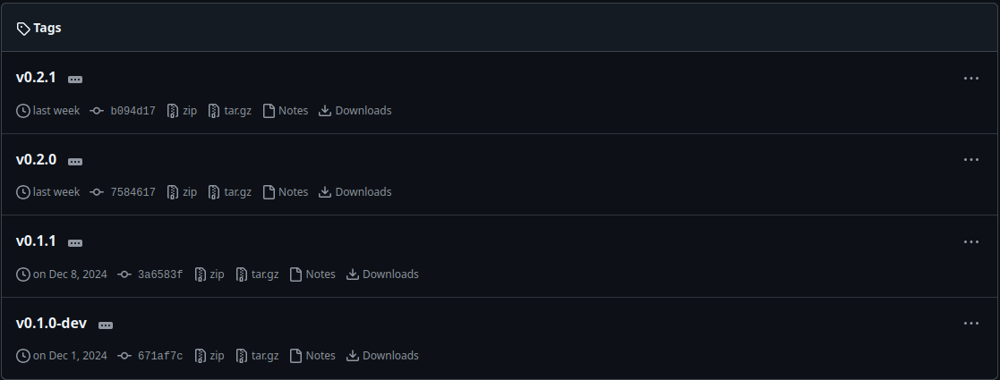
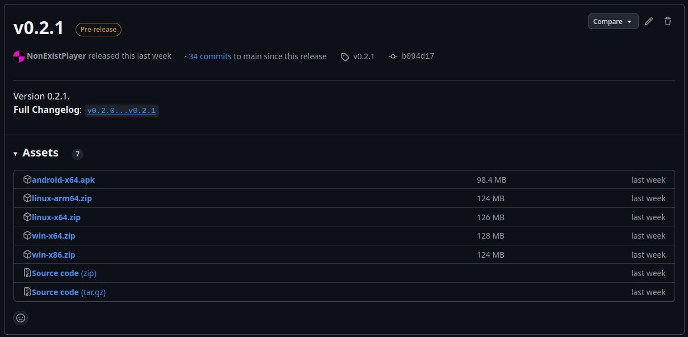

This document describes how to build and run the **Eclair** source code.
# Preparation
Before you begin (obviously), you should download the source code from the repository.<br>
If you have `git`, you can download the source code with the following command:
```bash
git clone https://github.com/NonExistPlayer/EclairPlayer
```
The above command will install the source code into the "EclairPlayer" directory.<br>
Alternatively, you can simply install the zip archive with the source code as follows:
1. Open the GitHub repository page. You can quickly go [here](https://github.com/NonExistPlayer/EclairPlayer).<br>

2. Find the releases section and go there.<br>

3. Select the latest release.<br>

4. In "Assets" find the zip archive labeled "Source code" and download it.<br><br>
Next, you will need to download [.NET SDK 9.0](https://dotnet.microsoft.com/ru-ru/download/dotnet/9.0).
# Build
After installing the source code and .NET SDK, you can start compiling.<br>
Depending on the platform on which you need to build the project (computer or phone), follow the instructions provided.

## Computer
1. Open a terminal.
2. Go to the source code directory.
3. Go to the `Eclair.Desktop` directory.
4. Run the following command:
```bash
dotnet run
```
This will run the project. In the console, you will see the **Eclair** log.<br>
To only compile without running, you will need to write:
```bash
dotnet build
```
The compiled application will be stored here:<br>
`<source-code>/Eclair.Desktop/bin/Debug/net9.0`
## Phone
1. Install: *Java SDK **17***, *Android SDK*, *Android SDK Build-Tools **35, 34***.
2. Open a terminal.
3. Go to the source code directory.
4. Go to the `Eclair.Android` directory.
5. To compile, run the following command:
```bash
dotnet build -c Release
```
`.APK` file will be stored at:<br>
`<source-code>/Eclair.Android/bin/Release/net9.0-android/net.nonexistplayer.eclair-Signed.apk`<br>
Compilation may take a long time.