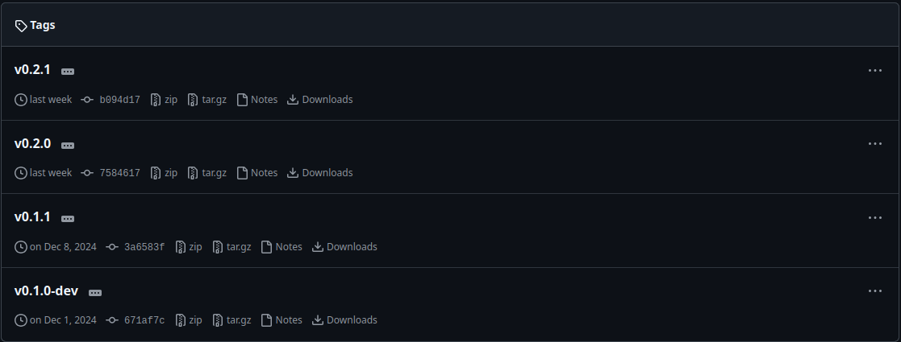
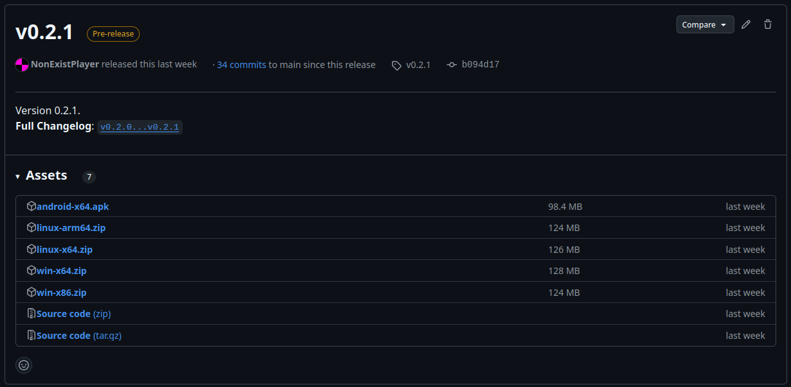

В этом документе написано как собрать и запустить исходный код **Eclair**.
# Подготовка
Перед началом (очевидно) стоит скачать исходный код репозитория.<br>
Если у вас есть `git` можно скачать исходный код следующей команды:
```bash
git clone https://github.com/NonExistPlayer/EclairPlayer
```
Указанная выше команда установит исходный код в каталог "EclairPlayer".<br>
Или же, вы можете просто установить zip-архив с исходным кодом следующим образом:
1. Откройте страницу репозитория GitHub. Быстро перейти вы можете [здесь](https://github.com/NonExistPlayer/EclairPlayer).<br>

2. Найдите раздел с релизами и перейдите туда.<br>

3. Выберете последний релиз.<br>

4. В "Assets" найдите zip-архив с надписью "Source code" и скачайте его.<br><br>
Далее нужно будет скачать [.NET SDK 9.0](https://dotnet.microsoft.com/ru-ru/download/dotnet/9.0).
# Сборка
После установки исходного кода и .NET SDK, можно начать компиляцию.<br>
В зависимости от платформы на которую нужно будет собрать проект (компьютер или телефон) следуйте указанным инструкциям.

## Компьютер
1. Откройте терминал.
2. Перейдите в директорию с исходным кодом.
3. Зайдите в каталог `Eclair.Desktop`.
4. Выполните следующую команду:
```bash
dotnet run
```
Это запустит проект. В консоли вы будете видеть лог **Eclair**.<br>
Для только компиляции без запуска вам потребуется написать:
```bash
dotnet build
```
Скомпилированное приложение будет храниться здесь:<br>
`<исходный-код>/Eclair.Desktop/bin/Debug/net9.0`
## Телефон
1. Установите: *Java SDK **17***, *Android SDK*, *Android SDK Build-Tools **35, 34***.
2. Откройте терминал.
3. Перейдите в директорию с исходным кодом.
4. Зайдите в каталог `Eclair.Android`.
5. Для компиляции выполните следующую команду:
```bash
dotnet build -c Release
```
`.APK`-файл будет храниться по пути:<br>
`<исходный-код>/Eclair.Android/bin/Release/net9.0-android/net.nonexistplayer.eclair-Signed.apk`<br>
Компиляция может занять много времени.